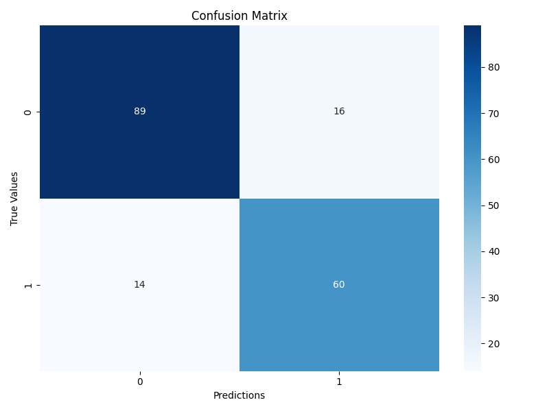
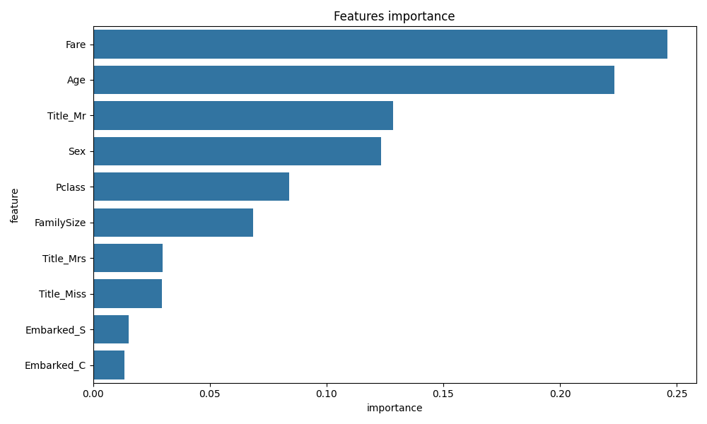

# Titanic Survival Prediction

This project uses a classification model to predict the survival of Titanic passengers based on their characteristics.

## Confusion Matrix


## Features Importance


## Requirements

- Python 3.6 or higher
- pandas
- numpy
- seaborn
- matplotlib
- scikit-learn

# Installation

## Setup

1. **Clone the repository:**

```bash
git clone git@github.com:iamhmh/titanic_survival_prediction.git
cd titanic_survival_prediction
```

2. **Install dependencies:**
```bash
pip install -r requirements.txt
```

## Usage

1. **Run the training script:**

```bash
python survival_prediction.py
```

## Project Structure

- `survival_prediction.py`: Contains the main script for loading data, cleaning data, training the model, and evaluating the model.

## Model Training

A random forest model is trained on the cleaned data:

```python
def train_model(X_train, y_train):
    model = RandomForestClassifier(n_estimators=100, random_state=42)
    model.fit(X_train, y_train)
    return model
```

## Model evaluation

The model is evaluated using a classification report and confusion matrix :

```python
def evaluate_model(model, X_test, y_test):
    predictions = model.predict(X_test)
    print("\Classification Report :")
    print(classification_report(y_test, predictions))
    
    cm = confusion_matrix(y_test, predictions)
    plt.figure(figsize=(8, 6))
    sns.heatmap(cm, annot=True, fmt='d', cmap='Blues')
    plt.title('Confusion Matrix')
    plt.ylabel('True Values')
    plt.xlabel('Predictions')
    plt.tight_layout()
    plt.savefig('confusion_matrix.png')
    plt.close()
    
    feature_importance = pd.DataFrame({
        'feature': X_test.columns,
        'importance': model.feature_importances_
    }).sort_values('importance', ascending=False)
    
    plt.figure(figsize=(10, 6))
    sns.barplot(x='importance', y='feature', data=feature_importance.head(10))
    plt.title('Features importance')
    plt.tight_layout()
    plt.savefig('feature_importance.png')
    plt.close()
```

## License

This project is licensed under the MIT License.

## Author

- **HICHEM GOUIA** - (https://github.com/iamhmh)